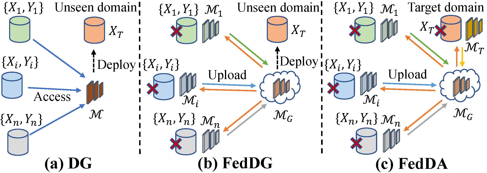
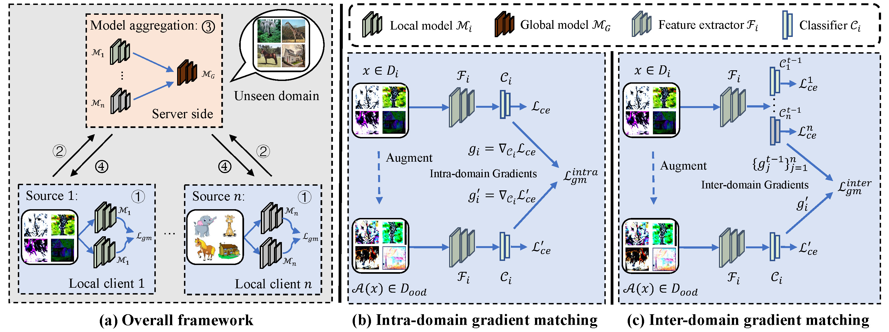
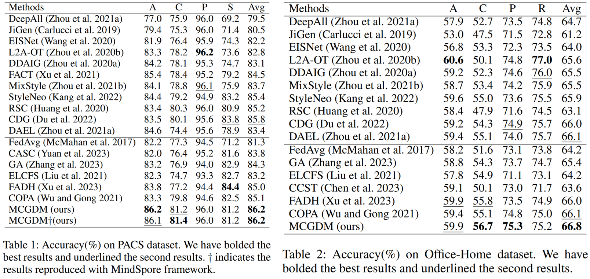
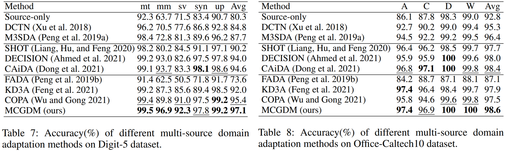

# Multi-Source Collaborative Gradient Discrepancy Minimization for Federated Domain Generalization
Here is the official implementation of `MCGDM` method in the paper `Multi-Source Collaborative Gradient Discrepancy Minimization for Federated Domain Generalization, in AAAI 2024` [paper](https://arxiv.org/abs/2401.10272), [video](https://www.youtube.com/watch?v=z9qP_ezXGRE).

## Abstract
Federated Domain Generalization aims to learn a domain-invariant model from multiple decentralized source domains for deployment on unseen target domain. Due to privacy concerns, the data from different source domains are kept isolated, which poses challenges in bridging the domain gap. To address this issue, we propose a Multi-source Collaborative Gradient Discrepancy Minimization (MCGDM) method for federated domain generalization. Specifically, we propose intra-domain gradient matching between the original images and augmented images to avoid overfitting the domain-specific information within isolated domains. Additionally, we propose inter-domain gradient matching with the collaboration of other domains, which can further reduce the domain shift across decentralized domains. Combining intra-domain and inter-domain gradient matching, our method enables the learned model to generalize well on unseen domains. Furthermore, our method can be extended to the federated domain adaptation task by fine-tuning the target model on the pseudo-labeled target domain. The extensive experiments on federated domain generalization and adaptation indicate that our method outperforms the state-of-the-art methods significantly.

## Different setups of domain generalization

  

* (a) Domain Generalization (DG) assumes that the data from multiple source domains can be accessed simultaneously to learn a generalizable model for deployment on the unseen domain.
* (b) Federated Domain Generalization (FedDG) assumes that the data from different source domains are decentralized, but the local models of different domains can be collaboratively trained and aggregated with a parameter server.
* (c) Federated Domain Adaptation (FedDA) assumes that an additional unlabeled target domain can be accessed on server side for improving the performance.

## Method

  

* (1) Collaborative train the decentralized domains: Due to the data from different domains are decentralized, we utilize the federated learning framework, e.g. FedAvg to collaborative train the multiple decentralized source domains.
* (2) Gradient discrepancy indicates the domain-specific information: Inspired by the hypothesis that the gradient discrepancy between domains indicates the model updating to be domain-specific, we utilize the gradient discrepancy to detect the domain shift.
* (3) Reducing the domain shift under the data decentralization scenario: Under the data decentralization scenario, we propose to learn the intrinsic semantic information within isolated domain and reduce the domain shift between decentralized domains by reducing the gradient discrepancy within domain and across domains.

## Setup
### Install Package Dependencies
```
Python Environment: >= 3.6
torch >= 1.2.0
torchvision >= 0.4.0
tensorbard >= 2.0.0
numpy
yaml
```
### Install Datasets
Please prepare the PACS, Office-Home, VLCS dataset for FedDG task and Digits-5, Office-Caltech10 dataset for FedDA task.
```
base_path
│       
└───dataset
│   │   pacs
│       │   images
│       │   splits
│   │   office_home_dg
│       │   art
│       │   clipart
│       │   product
│       │   real_world
│   │   DigitFive
│       │   ...
│   │   OfficeCaltech10
│       │   ...
```


### FedDG
The configuration files can be found under the folder  `./config`, and we provide four config files with the format `.yaml`. To perform the FedDG on the specific dataset (e.g., PACS), please use the following commands:

```python
python main_dg.py --config PACS.yaml --target-domain art_painting -bp ../ --intra 0.0 --inter 0.0 --seed 2 --wandb 0 --gpu 0

python main_dg.py --config PACS.yaml --target-domain cartoon -bp ../ --intra 0.0 --inter 0.0 --seed 2 --wandb 0 --gpu 1

python main_dg.py --config PACS.yaml --target-domain photo -bp ../ --intra 0.0 --inter 0.0 --seed 2 --wandb 0 --gpu 2

python main_dg.py --config PACS.yaml --target-domain sketch -bp ../ --intra 0.0 --inter 0.0 --seed 2 --wandb 0 --gpu 3
```

The trained model on PACS dataset can be downloaded in Baidu Yun:

Link: https://pan.baidu.com/s/1n2slY_jf_EJQoIOZqxfCwg

Code: t782

The results on PACS and Office-Home dataset for FedDG task are follows.

  

The results on Digits-5 and Office-Caltech10 dataset for FedDA task are follows.

  

## Reference

If you find this useful in your work please consider citing:
```
@article{wei2024multi,
  title={Multi-Source Collaborative Gradient Discrepancy Minimization for Federated Domain Generalization},
  author={Wei, Yikang and Han, Yahong},
  journal={arXiv preprint arXiv:2401.10272},
  year={2024}
}
```

And there are some federated multi-source domain adaptation methods proposed by us.
```
@ARTICLE{wei2022multi,
  author={Wei, Yikang and Yang, Liu and Han, Yahong and Hu, Qinghua},
  journal={IEEE Transactions on Circuits and Systems for Video Technology}, 
  title={Multi-Source Collaborative Contrastive Learning for Decentralized Domain Adaptation}, 
  year={2023},
  volume={33},
  number={5},
  pages={2202-2216},
  doi={10.1109/TCSVT.2022.3219893}
}

@inproceedings{wei2023exploring,
  title={Exploring Instance Relation for Decentralized Multi-Source Domain Adaptation},
  author={Wei, Yikang and Han, Yahong},
  booktitle={ICASSP 2023-2023 IEEE International Conference on Acoustics, Speech and Signal Processing (ICASSP)},
  pages={1--5},
  year={2023},
  organization={IEEE}
}

@article{wei2022dual,
  title={Dual collaboration for decentralized multi-source domain adaptation},
  author={Wei, Yikang and Han, Yahong},
  journal={Frontiers of Information Technology \& Electronic Engineering},
  volume={23},
  number={12},
  pages={1780--1794},
  year={2022},
  publisher={Springer}
}
```

## Acknowledgments
The codes will be released once they are annotated. This work is supported by the CAAI-Huawei MindSpore Open Fund. Please use the [MindSpore version](https://gitee.com/luckyyk/fedgm)
